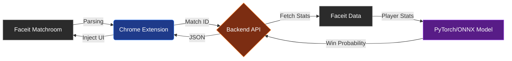

# 🎯 Faceit Predictor for CS2


[](https://github.com/BlackAlexYT/faceit-predictor/blob/main/README.md)

**Faceit Predictor** — это интеллектуальная система для прогнозирования результатов матчей Counter-Strike 2 на платформе FACEIT в режиме реального времени. Проект использует нейросеть архитектуры DeepSets для анализа статистики игроков и выдает вероятность победы каждой команды прямо в браузере.

## 🕹 Демонстрация


*Виджет автоматически анализирует пики карт и составы команд.*

## ✨ Особенности

*   **Real-time прогноз:** Анализ матча сразу после появления лобби (Map picking phase).
*   **Глубокая аналитика:** Учитывает более 40 параметров для каждого игрока (ELO, K/D, ADR за всё время, последние 5/50 матчей, статистика на конкретной карте).
*   **Учет карт:** Для каждой соревновательной карты (Mirage, Ancient, Nuke и др.) обучена отдельная специализированная модель.
*   **Chrome Extension:** Удобный виджет, интегрирующийся прямо в интерфейс матч-рума Faceit.
*   **Высокая скорость:** Использование ONNX Runtime обеспечивает инференс модели за миллисекунды.

## 🏗 Архитектура

Проект состоит из трех основных модулей:

1.  **Data Pipeline & Training (`/train`)**:
    *   Асинхронный парсер (`aiohttp`) собирает исторические матчи Faceit.
    *   Препроцессинг данных и очистка пропусков.
    *   Обучение нейросети на PyTorch.
    *   Экспорт весов в формат ONNX.
2.  **Backend Server (`server.py`)**:
    *   FastAPI сервис.
    *   Парсинг текущего матча "на лету".
    *   Инференс ONNX моделей.
3.  **Frontend (`/extension`)**:
    *   Расширение для браузера (Manifest V3).
    *   Инъекция UI в Faceit.




## 🚀 Установка и запуск

### 1. Серверная часть

```bash
# Клонирование репозитория
git clone https://github.com/your-username/faceit-predictor.git
cd faceit-predictor

# Установка зависимостей
pip install -r server_requirements.txt

# Запуск сервера (убедитесь, что модели .onnx лежат в папке models/)
python server.py
```

### 2. Обучение модели (опционально)

Если вы хотите переобучить модель на своих данных:
1. Получите UIDs пользователей, чьи матчи будете собирать.
2. Запустите парсер матчей: `python parse_matches.py` 
3. Для увеличения базы игроков можете запустить `python get_active_uids` 
4. Откройте `model.ipynb` в Jupyter Notebook и выполните ячейки для тренировки и экспорта.

### 3. Расширение для Chrome

1. Перейдите в `chrome://extensions/`
2. Включите "Режим разработчика" (Developer mode).
3. Нажмите "Загрузить распакованное расширение" (Load unpacked).
4. Выберите папку с файлами расширения (`manifest.json`, `content.js`, `styles.css` и др.).
5. Замените в файлах `manifest.json`, `content.js` адрес сервера на свой сервер, если мой уже не работает...

## 🧠 Как это работает?

Модель использует архитектуру, инвариантную к перестановкам внутри команды.
1. **Embedding Layer:** Преобразует сырые статы каждого игрока (10 человек) в скрытое представление.
2. **Aggregation:** Суммирует векторы игроков для Команды 1 и Команды 2 раздельно.
3. **Comparative Layer:** Сравнивает "силу" команд и выдает вероятность через сигмоиду.

## 📄 License

MIT License